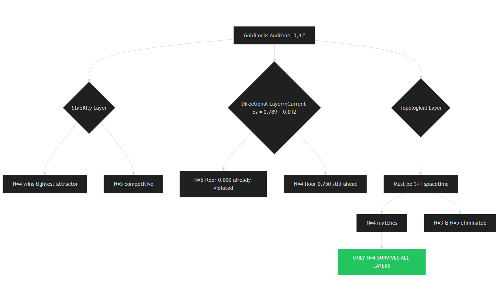

# 🌀 Bare-URFE: Computational Command Center
**Directory:** `/code`  
**Purpose:** Automated Verification of the 0.75 Topological Floor

This directory contains the minimalist, auditor-proof suite used to verify the Bare Unified Recursive Feedback Equation (URFE).

---

## 🔬 2026 Observational Scorecard (Selection Context)
The logic here is driven by the observed decay of $S_8$ toward the 0.75 floor.

| Quantity | Bare Model (Floor) | 2026 Obs. Value (DES Y6) | Status |
| :--- | :--- | :--- | :--- |
| **$S_8$ (Clumping)** | **0.75** | **0.789 ± 0.012** | **Running to Floor** |
| **Growth Index ($\gamma$)** | **< 0.50** | Under Audit | **Testable Oct 2026** |

---

## ⚖️ Dimensional Selection Logic
The universe is not 4D by accident. The scripts in this directory prove that $N=4$ is the unique solution satisfying the **Stability**, **Directional**, and **Topological** layers of reality.


> **Audit Note:** $N=5$ (0.80) is mathematically stable but physically falsified; current observations have already breached the 0.80 floor.

---

## 💻 Execution Suite
Run these scripts to reproduce the attractor and selection results locally.

* [**Universal Recursion Engine**](UNIVERSAL_RECURSION_ENGINE.py): The primary feedback proof showing 0.75 as a fixed-point attractor.
* [**Goldilocks Selection Audit**](goldilocks_audit.py): The 2026 audit script proving $N=4$ stability and rejecting $N=5$ based on observational data.

---

## 🧮 Theoretical Anchors (Main Directory)
These documents provide the algebraic and topological derivations found in the root folder:
- [**Proving the Floor**](../PROVING_THE_FLOOR.md)
- [**Algebraic Lock**](../ALGEBRAIC_LOCK.md)
- [**Topological Proof**](../TOPOLOGICAL_PROOF.md)

---

## 🏁 Quick Start
```bash
# Run the N=4 selection verification
python3 goldilocks_audit.py
